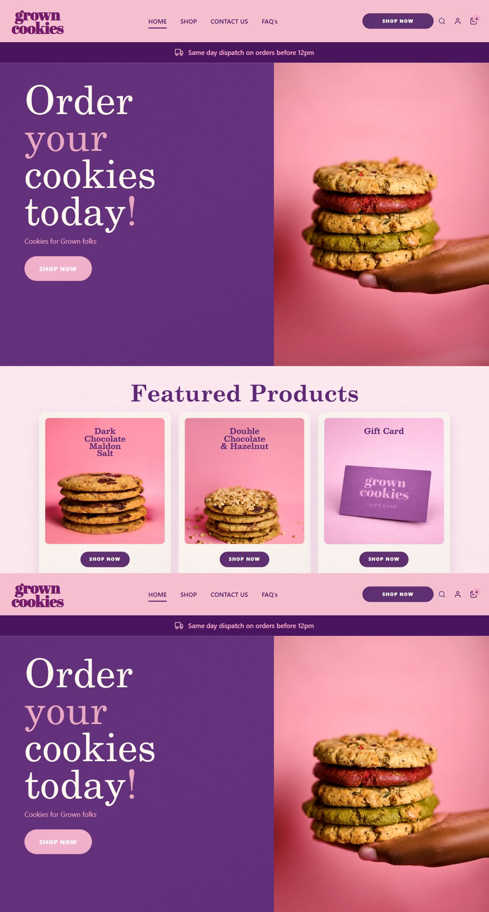

# Grown Cookies Storefront

A custom Next.js storefront for Grown Cookies with product discovery, basket and Stripe checkout, customer accounts, and a lightweight admin studio.



*Homepage hero and featured products from the current storefront UI.*

## Highlights

- Brand-led homepage and featured product merchandising
- Shop grid, product detail pages, search, and gift card support
- Basket flow and deferred Stripe Elements checkout with server-side confirmation and webhook handling
- Supabase-powered customer sign-in and account area
- Admin editing flow for products and featured storefront content
- Cloudflare-ready deployment path with D1 and R2 integrations

## Stack

- Next.js 16 + React 19 + TypeScript
- Supabase Auth for customer and admin identity
- Stripe for checkout and payment reconciliation
- Cloudflare D1 for storefront data
- Cloudflare R2 for media storage

## Local Setup

```bash
npm install
npm run dev
```

Open `http://localhost:3000`.

Useful scripts:

```bash
npm run build
npm run lint
npm run cloudflare:build
npm run cloudflare:deploy
npm run cloudflare:d1:migrate
```

## Environment

Create `.env.local` with the services this app depends on:

- Supabase: `NEXT_PUBLIC_SUPABASE_URL`, `NEXT_PUBLIC_SUPABASE_ANON_KEY`
- Admin security: `ADMIN_LOGIN_THROTTLE_SECRET`
- Stripe: `STRIPE_SECRET_KEY`, `NEXT_PUBLIC_STRIPE_PUBLISHABLE_KEY`, `STRIPE_WEBHOOK_SECRET`
- Cloudflare: account/D1/R2 values used by the admin, catalog, and deploy flows

Do not commit `.env.local` or real credentials.

`NEXT_PUBLIC_SUPABASE_ANON_KEY` is expected to be public in the browser bundle for Supabase Auth. This app uses Supabase for authentication only; storefront and admin data access in this repo is handled through server-side routes and Cloudflare services, not direct browser table queries.

Supabase Row Level Security still needs to be verified in the Supabase project itself. This repository does not contain repo-managed Supabase policy files, so confirm in the Supabase dashboard or SQL editor that `anon` and non-admin authenticated users cannot read or mutate any admin-only data.

Admin access is controlled from Supabase user `app_metadata`, not from an environment-variable allowlist. Mark an admin user in Supabase by setting either `role: "admin"`, `user_role: "admin"`, or `is_admin: true` inside that user's `raw_app_meta_data`.

Admin sign-in applies a temporary cooldown after repeated failed attempts and stores only hashed email/IP identifiers in D1. Set `ADMIN_LOGIN_THROTTLE_SECRET` to a long random server-only value before deploying so those hashes are salted consistently across instances.

Enable Supabase MFA for every admin user in the Supabase dashboard. This repo now hardens the login surface with throttling and browser security headers, but MFA still needs to be enforced in Supabase itself.

Example SQL for the Supabase SQL editor:

```sql
update auth.users
set raw_app_meta_data = coalesce(raw_app_meta_data, '{}'::jsonb) || '{"role":"admin"}'::jsonb
where email = 'adminemail@host.com';
```

## Deployment

Cloudflare Pages deployment is wired through the project scripts:

```bash
npm run cloudflare:deploy
```

Before deploying, verify Wrangler auth and token scope requirements in [`cloudflare-upload.md`](cloudflare-upload.md). That guide is the source of truth for authentication, Pages deploy commands, environment variables, and Stripe webhook setup.

For D1 schema changes, this repo now includes `wrangler.toml` and migrations in `cloudflare/d1/migrations`. After authenticating with Cloudflare, apply the remote migration with:

```bash
npm run cloudflare:d1:migrate
```

Replace the placeholder `database_id` in `wrangler.toml` with your real D1 database ID before running migrations.
