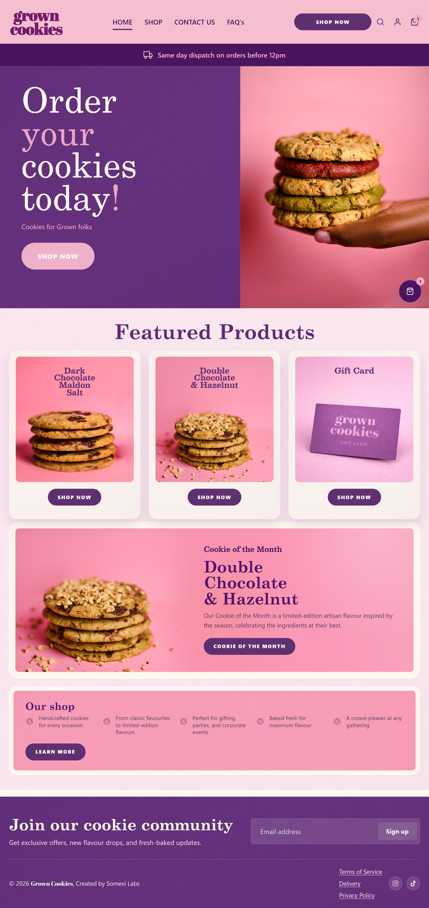

# Grown Cookies Storefront

A custom Next.js storefront for Grown Cookies with product discovery, basket and Stripe checkout, customer accounts, and a lightweight admin studio.



*Homepage hero and featured products from the current storefront UI.*

Grown Cookies is a website for a cookie store built to feel warm, easy to use, and enjoyable to browse. The aim is to make the product feel tempting from the first screen, with an interactive UI that encourages people to click, explore flavours, add items to their basket, and complete checkout without friction.

The site focuses on pretty, responsive UI design that supports the buying journey rather than getting in the way of it. It uses Next.js, React, TypeScript, Supabase, Stripe, Cloudflare D1, and Cloudflare R2 to combine a polished storefront with practical ecommerce features.

## Highlights

- Brand-led homepage and featured product merchandising
- Shop grid, product detail pages, search, and gift card support
- Basket flow and deferred Stripe Elements checkout with server-side confirmation and webhook handling
- Supabase-powered customer sign-in and account area
- Admin editing flow for products and featured storefront content
- Cloudflare-ready deployment path with D1 and R2 integrations

## Stack

- Next.js 16 + React 19 + TypeScript
- Supabase Auth for customer and admin identity
- Stripe for checkout and payment reconciliation
- Cloudflare D1 for storefront data
- Cloudflare R2 for media storage

## Admin Data Map

All Cloudflare D1-backed admin data uses the `DB` binding in `wrangler.toml`, which points to the D1 database `grown-cookies` with database id `8fe24791-e39c-42ea-afd0-f4ec4a60b56c`.

| Admin area / element | Connected storage |
| --- | --- |
| Admin sign-in | Supabase Auth. Cloudflare D1 only stores failed login throttle records in `admin_login_attempts`. |
| Product list | D1 `products`, joined with `featured_products`, `product_images`, and `product_image_variants`. |
| Add/edit product fields | D1 `products`: `name`, `slug`, `price`, `description`, `allergens`, `is_gift_card`, `hidden`, `featured`, and `sort_order`. |
| Product image upload, thumbnail, and crop data | Image files are uploaded to Cloudflare R2 under `products/{slug}/...`; D1 stores image keys and crop metadata in `product_images` and `product_image_variants`. |
| Show on homepage / featured position | D1 `products.featured` plus `featured_products.product_slug` and `featured_products.position`. |
| Hide/show product | D1 `products.hidden`; hiding the selected Cookie of the Month product can also clear `store_settings.cookie_of_month_product_slug`. |
| Catalogue reorder buttons | D1 `products.sort_order`. |
| Featured reorder buttons | D1 `featured_products.position`. |
| Cookie of the Month product tickbox | D1 `store_settings` key `cookie_of_month_product_slug`. |
| Cookie of the Month page text/button | D1 `store_settings` keys `cookie_of_month_title`, `cookie_of_month_cta_label`, and `cookie_of_month_product_slug`. |
| Orders page, order details, and gift card redemptions | D1 `orders`, `order_items`, and `gift_card_redemptions`. |
| Mark delivered | Updates D1 `orders.status`, `orders.delivered_at`, and `orders.updated_at`. |
| Delivery fee | D1 `store_settings` key `delivery_cost_cents`. |
| Dispatch availability | D1 `store_settings` keys `dispatch_enabled_weekdays`, `dispatch_same_day_enabled`, `dispatch_cutoff_time`, `dispatch_minimum_prep_days`, and `dispatch_booking_horizon_days`. |
| Delivery banner | D1 `store_settings` keys `delivery_banner_text` and `delivery_banner_icon`. |
| Analytics traffic | Google Analytics Data API, not Cloudflare D1. |
| Analytics sales/revenue/top products | D1 `orders` and `order_items`. |
| Mailing list | D1 `mailing_list_subscribers`. |
| Mailing list delete | Deletes from D1 `mailing_list_subscribers`. |
| Launch/site lock | D1 `store_settings` key `site_lock_enabled`. |

## Local Setup

```bash
npm install
npm run dev
```

Open `http://localhost:3000`.

Useful scripts:

```bash
npm run build
npm run lint
npm run cloudflare:build
npm run cloudflare:deploy
npm run cloudflare:deploy:domain
npm run cloudflare:preview
npm run cloudflare:d1:migrate
```

## Environment

Create `.env.local` with the services this app depends on:

- Supabase: `NEXT_PUBLIC_SUPABASE_URL`, `NEXT_PUBLIC_SUPABASE_ANON_KEY`, `NEXT_PUBLIC_SITE_URL`
- Admin security: `ADMIN_LOGIN_THROTTLE_SECRET`
- Checkout security: `CHECKOUT_THROTTLE_SECRET`, optional `CHECKOUT_RETURN_ALLOWED_ORIGINS`
- Stripe: `STRIPE_SECRET_KEY`, `NEXT_PUBLIC_STRIPE_PUBLISHABLE_KEY`, `STRIPE_WEBHOOK_SECRET`
- Google Analytics: optional browser tracking `NEXT_PUBLIC_GA_MEASUREMENT_ID`; optional admin reporting `GOOGLE_ANALYTICS_PROPERTY_ID`, `GOOGLE_ANALYTICS_CLIENT_EMAIL`, `GOOGLE_ANALYTICS_PRIVATE_KEY`
- Order email notifications: `RESEND_API_KEY`, `ORDER_NOTIFICATION_FROM`, optional `ORDER_NOTIFICATION_TO`
- Contact/order enquiry form: `TURNSTILE_SITE_KEY`, `TURNSTILE_SECRET_KEY`, `CONTACT_THROTTLE_SECRET`, `ZOHO_CLIENT_ID`, `ZOHO_CLIENT_SECRET`, `ZOHO_REFRESH_TOKEN`, `ZOHO_ACCOUNT_ID`, optional `CONTACT_FORM_FROM`, optional `CONTACT_FORM_TO`
- Cloudflare runtime: `CLOUDFLARE_ACCOUNT_ID` and R2 values used by admin media upload/delete. D1 uses the `DB` binding in `wrangler.toml`, not runtime account API credentials.
- Cloudflare deploy: keep `CLOUDFLARE_API_TOKEN`, if used, in your local shell or CI secrets only. Do not put it in `.env.local` or upload it to the Worker runtime.

Do not commit `.env.local` or real credentials.

Set `NEXT_PUBLIC_GA_MEASUREMENT_ID` to your Google Analytics 4 measurement ID, for example `G-XXXXXXXXXX`, to enable the analytics consent banner and GA loader. Google Analytics starts with Consent Mode denied and only loads after the visitor chooses "Allow analytics"; the privacy page lets visitors change that choice later.

The admin analytics dashboard uses Google Analytics Data API read access separately from the browser tracking ID. Set `GOOGLE_ANALYTICS_PROPERTY_ID` to the numeric GA4 property ID, then create a Google service account with Viewer access to that GA4 property and set `GOOGLE_ANALYTICS_CLIENT_EMAIL` and `GOOGLE_ANALYTICS_PRIVATE_KEY` from its key file. Store `GOOGLE_ANALYTICS_PRIVATE_KEY` as a single-line secret with escaped `\n` line breaks.

`NEXT_PUBLIC_SUPABASE_ANON_KEY` is expected to be public in the browser bundle for Supabase Auth. This app uses Supabase for authentication only; storefront and admin data access in this repo is handled through server-side routes and Cloudflare services, not direct browser table queries.

Set `NEXT_PUBLIC_SITE_URL` to the canonical public origin used by customer auth redirects, for example `https://growncookies.co.uk`. The social OAuth flows and Supabase email confirmation links now prefer this value over browser-origin fallbacks, which prevents production auth from bouncing back to `localhost` when Supabase redirect settings fall back to the project site URL.

Supabase Row Level Security still needs to be verified in the Supabase project itself. This repository does not contain repo-managed Supabase policy files, so confirm in the Supabase dashboard or SQL editor that `anon` and non-admin authenticated users cannot read or mutate any admin-only data.

Admin access is controlled from Supabase user `app_metadata`, not from an environment-variable allowlist. Mark an admin user in Supabase by setting either `role: "admin"`, `user_role: "admin"`, or `is_admin: true` inside that user's `raw_app_meta_data`.

Admin sign-in applies a temporary cooldown after repeated failed attempts and stores only hashed email/IP identifiers in D1. Set `ADMIN_LOGIN_THROTTLE_SECRET` to a long random server-only value before deploying so those hashes are salted consistently across instances.

Checkout payment confirmation now applies a D1-backed attempt throttle before order creation and PaymentIntent creation. Set `CHECKOUT_THROTTLE_SECRET` to a long random server-only value before deploying so hashed checkout identifiers stay stable across instances. If you intentionally want one shared salt, the checkout throttle falls back to `ADMIN_LOGIN_THROTTLE_SECRET`, but a dedicated value is preferred.

Stripe return URLs only use allowlisted origins. Production domains and the default local dev origins are allowed by default; set `CHECKOUT_RETURN_ALLOWED_ORIGINS` to a comma-separated list when checkout needs to work from Cloudflare previews or another custom origin.

Contact form submissions require Cloudflare Turnstile validation and a D1-backed IP/email throttle before any Zoho or Resend email is sent. Set `TURNSTILE_SITE_KEY`, `TURNSTILE_SECRET_KEY`, and `CONTACT_THROTTLE_SECRET` before production deploys. Local development uses Cloudflare's official Turnstile test keys when real keys are absent, but production fails closed if Turnstile is not configured.

Enable Supabase MFA for every admin user in the Supabase dashboard. This repo now hardens the login surface with throttling and browser security headers, but MFA still needs to be enforced in Supabase itself.

Example SQL for the Supabase SQL editor:

```sql
update auth.users
set raw_app_meta_data = coalesce(raw_app_meta_data, '{}'::jsonb) || '{"role":"admin"}'::jsonb
where email = 'adminemail@host.com';
```

## Deployment

Cloudflare deployment now targets Workers via the OpenNext Cloudflare adapter:

```bash
npm run cloudflare:deploy
```

To deploy the production worker and attach the live domains in one command, use:

```bash
npm run cloudflare:deploy:domain
```

Before the first worker deploy, upload runtime secrets from a Worker-only env file:

```bash
npx wrangler secret bulk .env.worker
```

Do not bulk upload `.env.local`. The Worker runtime must not receive deploy-only values such as `CLOUDFLARE_API_TOKEN`, and D1 does not need `CLOUDFLARE_D1_DATABASE_ID` as a runtime secret. Use `npm run cloudflare:preview` or Wrangler D1 commands for D1-backed local work instead of querying remote D1 from plain `next dev`.

Before deploying, verify Wrangler auth and token scope requirements in [`cloudflare-upload.md`](cloudflare-upload.md). That guide is the source of truth for authentication, Workers deploy commands, custom-domain attachment, environment variables, and Stripe webhook setup.

Production order notifications are sent after `payment_intent.succeeded` through the Stripe webhook. Configure a verified sender in Resend with `ORDER_NOTIFICATION_FROM`, set `RESEND_API_KEY`, and optionally override the recipient with `ORDER_NOTIFICATION_TO`. If `ORDER_NOTIFICATION_TO` is unset, notifications default to `orders@growncookies.co.uk`.

The `/contact` page now submits server-side, verifies Cloudflare Turnstile, applies the D1 contact throttle, and then sends through the Zoho Mail API when the Zoho contact-form secrets are set. Configure `TURNSTILE_SITE_KEY`, `TURNSTILE_SECRET_KEY`, `CONTACT_THROTTLE_SECRET`, `ZOHO_CLIENT_ID`, `ZOHO_CLIENT_SECRET`, `ZOHO_REFRESH_TOKEN`, and `ZOHO_ACCOUNT_ID`, then set `CONTACT_FORM_FROM` if you want a specific Zoho mailbox or alias as the sender. `CONTACT_FORM_TO` remains optional and defaults to `orders@growncookies.co.uk`. If Zoho is unavailable, the route falls back to the existing Resend setup when that is configured.

Local `next dev` can send real contact-form email when either the Zoho Mail API secrets or the Resend fallback secrets are configured.

For D1 schema changes, this repo now includes `wrangler.toml` and migrations in `cloudflare/d1/migrations`. After authenticating with Cloudflare, apply the remote migration with:

```bash
npm run cloudflare:d1:migrate
```

